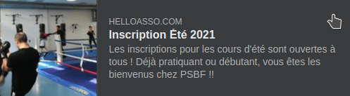

\
[Inscription Eté](https://www.helloasso.com/associations/psbf-paris-savate-boxe-francaise/adhesions/inscription-ete) | [Inscription Offre découverte 15J](https://www.helloasso.com/associations/psbf-paris-savate-boxe-francaise/adhesions/inscription-ete-1)

Le Club Paris Savate Boxe Française donne des cours cet été en intérieur.

Vous retrouverez le planning des salles en bas de post

- Si vous êtes déjà adhérent-e, venez comme vous êtes.

- Si vous ne l'êtes pas, vous pouvez assister à un cours d'essai gratuit. 
Pour cela vous devez :
    - envoyer un SMS au 07 77 86 30 43 avec vos noms, prénoms (un sms par personne) et vos questions
     
    - Venir avec une tenue de sport et des baskets propres (qui ne servent pas à marcher dehors), et une paire de gants adaptée à votre poids (vous pouvez poser la question dans votre sms)

    - Trois tarifs sont proposés :
        -  Vous voulez découvrir la savate pendant 15 jours : nous vous proposons un tarif à 15 Euros avec la carte savate.

            [Inscription Offre découverte 15J](https://www.helloasso.com/associations/psbf-paris-savate-boxe-francaise/adhesions/inscription-ete-1)

        - Vous voulez boxer tout l'été : si vous avez déjà une licence dans un autre club, le tarif est de 30 euros pour l'accès à tous les cours tout l'été. Vous n'avez pas de licence, le tarif est de 64 Euros.

            [Inscription Eté](https://www.helloasso.com/associations/psbf-paris-savate-boxe-francaise/adhesions/inscription-ete)

Tous les créneaux sont de 19h00 à 20h30.

JUILLET : 
- Jeudi 1/07 : RIPOCHE
- Vendredi 2/07 : BERCY BASTILLE
- Lundi 5/07 : BERCY BASTILLE
- Mercredi 7/07 : LEON MOTTOT
- Jeudi 8/07 : RIPOCHE
- Vendredi 9/07 : LEON MOTTOT
- Lundi 12/07 : LEON MOTTOT
- Jeudi 15/07 : RIPOCHE
- Vendredi 16/07 : LEON MOTTOT
- Lundi 19/07 : LEON MOTTOT
- Mercredi 21/07 : LEON MOTTOT
- Vendredi 23/07 : LEON MOTTOT
- Lundi 26/07 : LEON MOTTOT
- Mercredi 28/07 : LEON MOTTOT
- Vendredi 30/07 : LEON MOTTOT

AOUT :
- Lundi 2/08 : LEON MOTTOT 
- Mercredi 4/08 : LEON MOTTOT
- Lundi 9/08 : LEON MOTTOT
- Mercredi 11/08 : LEON MOTTOT
- Vendredi 13/08 : LEON MOTTOT
- Lundi 16/08 : LEON MOTTOT
- Mercredi 18/08 : LEON MOTTOT
- Vendredi 20/08 : LEON MOTTOT
- Lundi 23/08 : LEON MOTTOT
- Mercredi 25/08 : LEON MOTTOT
- Lundi 30/08 : LEON MOTTOT

**Salle de boxe Léon Mottot**\
17 cité Moynet\
75012 PARIS\
Métro. Montgallet, ligne 8

**Salle Ripoche**\
58 rue Maurice Ripoche\
75014 PARIS\
Métro : Pernety

**Gymnase Bercy**\
242 rue de Bercy\
75012 PARIS\
Métro : Quai de la rapée (ligne 5) ou Gare de Lyon (ligne 1)

Rendez-vous sur la page [Inscription Eté](https://www.helloasso.com/associations/psbf-paris-savate-boxe-francaise/adhesions/inscription-ete)

