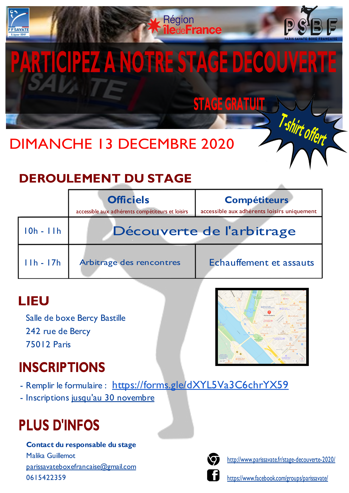

Nous vous proposons un stage 

<strong>« DECOUVERTE DE L’ARBITRAGE ET DE LA COMPETITION »</strong>

Ce stage est gratuit et réservé aux adhérents PSBF uniquement !

 Il s’adresse à ceux qui n’ont jamais été compétiteur et qui souhaite tester la compétition le temps d’une journée dans des conditions de confort optimal.

Et comme il n’y pas de compétition sans officiels, nous proposons à tous une sensibilisation à l’arbitrage.

Vous pourrez tout le long de la journée jouer les différents rôles de l’Officiel : arbitre, juge, chrono lors des assauts organisés par le club.

Ce stage aura lieu le dimanche 13 décembre 2020 de 10h à 17h dans la salle de boxe de Bercy Bastille.

L’inscription est à faire avant le 30/11 au plus tard via ce formulaire https://forms.gle/dXYL5Va3C6chrYX59

Vous trouverez plus d’infos sur le flyer ci-joint !

Le stage aura lieu uniquement si les conditions sanitaires le permettent. Il pourra éventuellement être reporté en cas d’interdiction par les autorités.
Les inscrits seront tenus au courant en cas de report
Les dates de replis seront à priori le 31/01/2021 puis le 21/03/2021

