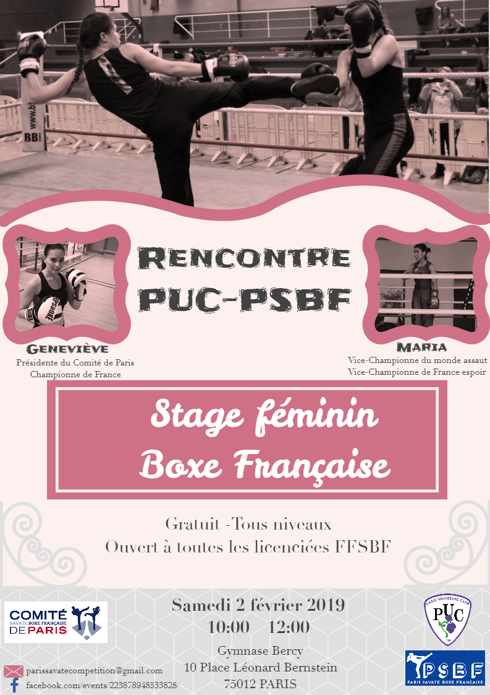

Samedi 2 février 2019 
10h-12h

Gratuit - Tout niveau
Ouvert à toutes les licenciées FFSBF
Places limitées : 30 personnes

Gymnase Bercy\
10, place Léonard Bernstein\
75012 PARIS\
Métro : Ligne 6  - Ligne 14 (arrêt Bercy).\
La salle se situe sous les grands escaliers qui mènent à la passerelle vers la BNF, à côté des machines de musculation extérieures, en face de la cinémathèque dans le Parc de Bercy.

Ce stage sera animé par Geneviève (PUC) et Maria (PSBF).

Il est organisé par le PSBF, et le PUC, mais est ouvert aux autres clubs dans la limite des places disponibles.
Il est ouvert à tout niveau, que ce soit pour préparer le Challenge débutant de Paris, ou le Challenge IDF, ou tout simplement pour se dépenser, et boxer avec de nouveaux partenaires sans stress et en toute convivialité, bonne humeur.

Il s'agit d'un cours commun composé de :
- Exercices Techniques et Technico-tactiques
- Assauts à thèmes
- Assauts libres

licence FFSBF obligatoire

Pour s'inscrire : 
https://docs.google.com/forms/d/e/1FAIpQLSfd-pHWzg85jbwbmRbASEXOP3A8DW27IZ7sAdkb6MnEpsW8uA/viewform

Pour toute information complémentaire : parissavatecompetition@gmail.com

